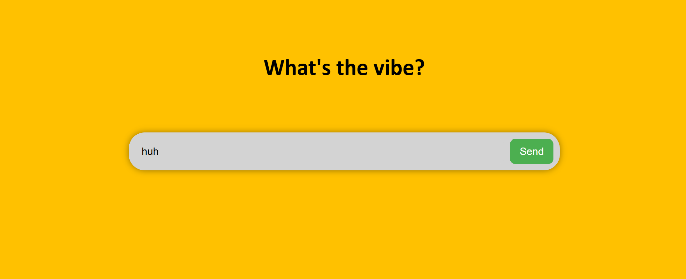
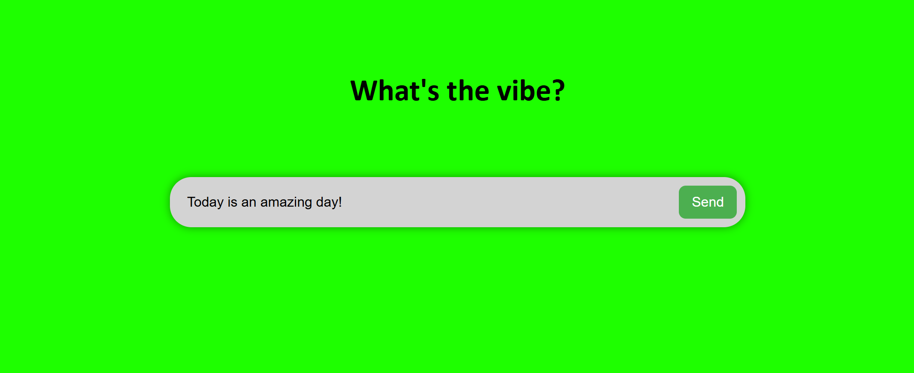
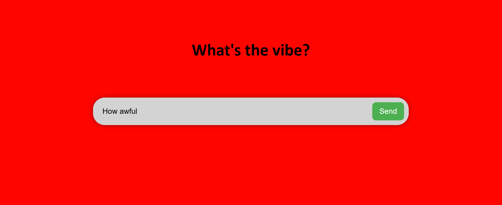

# LLMVibes

LLM Vibes incorporates sentiment analysis using a custom supervised fine-tuned llama 3 1B param model to determine the "vibe" of the text input by the user. The application processes the text in real-time and updates the background color of the webpage to reflect the sentiment of the input. Bright green shades represent positive sentiments, while bright red shades represent negative sentiments. The backend is built with Flask to handle the API requests and integrate with the Ollama service that runs the fine-tuned model. Fine-tuning was done using unsloth wiht a custom gpt-generated dataset. 

## Features

- Text input for users to enter their messages
- Real-time background color change based on the vibe score of the input text
- Local execution of the fine-tuned LLM using Ollama

## Installation

1. Clone the repository. 
2. Install the required dependencies using `pip install -r requirements.txt`.
3. Make sure Ollama is installed and running on your system
4. Download my fine-tune model from huggingface and place it in the appropriate directory: https://huggingface.co/SathRPI15/vibecheck/tree/main
    - Run Ollama by executing `ollama serve` in your terminal
    - Ensure that the fine-tuned model is loaded in Ollama
    - Run the model using `ollama run <model-name>` to test it
5. Start the Flask application using `python app.py`.
6. Open your web browser and navigate to `http://localhost:5000` to access the application.

## Usage

To use the application, simply enter any piece of text into the user input field and press the "Submit" button. The application will then process the text using the fine-tuned LLM and update the background color of the webpage to reflect the vibe score of the input text. After clicking the button, the LLM will take a moment to process the text and generate the sentiment analysis before updating the background color.

Yellow shades represent neutral sentiments.

Green shades represent positive sentiments.

Red shades represent negative sentiments.

